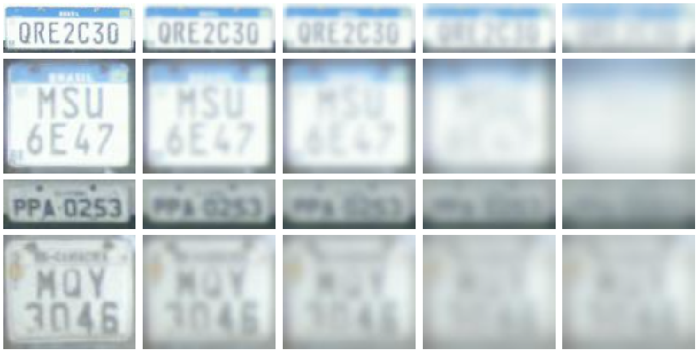

# RodoSol-LR-HR Dataset

This dataset contains 100,000 license plate (LP) images created from the [RodoSol-ALPR](https://github.com/raysonlaroca/rodosol-alpr-dataset) dataset, which comprises 20,000 images of different types of vehicles (e.g., cars and motorcycles), captured during the day and night, from distinct pay tolls, on clear and rainy days.

Among the 20,000 original images, there are 5,000 images of each of the following combination of vehicle type and LP layout:

* Cars with Brazilian LPs;
* Motorcycles with Brazilian LPs;
* Cars with Mercosur LPs;
* Motorcycles with Mercosur LPs.

While all Brazilian LPs consist of three letters followed by four digits, the initial pattern adopted in Brazil for Mercosur LPs consists of three letters, one digit, one letter and two digits, in that order (this is the pattern adopted on all Mercosur LPs in that dataset). In both layouts, car LPs have seven characters arranged in one row, whereas motorcycle LPs have three characters in one row and four characters in another.

The <b>20K high-resolution (HR)</b> images in our dataset were generated as follows. For each image from the RodoSol-ALPR dataset, we first cropped the LP region using the annotations provided by the authors. Afterward, we used the same annotations to rectify each LP image so that it becomes more horizontal, tightly bounded, and easier to recognize. The rectified image is the HR image.

The <b>80K low-resolution (LR)</b> images in our dataset were simulated by applying intense Gaussian noise (in terms of the structural similarity index measure &ndash; SSIM) to each HR image. This process is repeated until the desired degradation for a given LR image is reached. Intuitively, we measured the level of degradation of an LR image considering the SSIM score between it and the respective HR image.

Here are some representative examples of the RodoSol-LR-HR dataset:  
  
From left to right: 1 (original image), 0.75, 0.5, 0.25 and 0.1 SSIM scores. The original images are what we call HR, and the others (with reduced SSIM scores) are the LR ones.
<br>

The full details are in our [paper](https://raysonlaroca.github.io/papers/nascimento2022combining.pdf).

# How to obtain the dataset

The RodoSol-LR-HR dataset is released for academic research only and is free to researchers from educational or research institutes for **non-commercial purposes**. 

To be able to download the dataset, please read [**this license agreement**](./pdfs/license-agreement.pdf) carefully, fill it out and send it back to the second author ([rblsantos@inf.ufpr.br](mailto:rblsantos@inf.ufpr.br)) (who also manages access to the [RodoSol-ALPR](https://github.com/raysonlaroca/rodosol-alpr-dataset) dataset). **Your e-mail must be sent from a valid university account** (.edu, .ac or similar).

In general, you will receive a download link within 1-5 business days. Failure to follow the instructions may result in no response.


# Citation

If you use our dataset in your research, please cite:

* V. Nascimento, R. Laroca, J. A. Lambert, W. R. Schwartz, D. Menotti, “Combining Attention Module and Pixel Shuffle for License Plate Super-resolution,” in *Conference on Graphics, Patterns and Images (SIBGRAPI)*, pp. 7-12, Oct. 2022.

```
@inproceedings{nascimento2022combining,
  title = {Combining Attention Module and Pixel Shuffle for License Plate Super-resolution},
  author = {V. {Nascimento} and R. {Laroca} and J. A. {Lambert} and W. R. {Schwartz} and D. {Menotti}},
  year = {2022},
  month = {Oct},
  booktitle = {Conference on Graphics, Patterns and Images (SIBGRAPI)},
  volume = {},
  number = {},
  pages = {7-12},
  doi = {},
  issn = {1530-1834},
}
```

Additionally, consider showing your support by starring (:star:) this repository.

## Related publications

A list of all our papers on ALPR can be seen [here](https://scholar.google.com/scholar?hl=pt-BR&as_sdt=0%2C5&as_ylo=2018&q=allintitle%3A+plate+OR+license+OR+vehicle+author%3A%22David+Menotti%22&btnG=).

## Contact

Please contact Valfride Nascimento ([vwnascimento@inf.ufpr.br](mailto:rblsantos@inf.ufpr.br)) with questions or comments.

